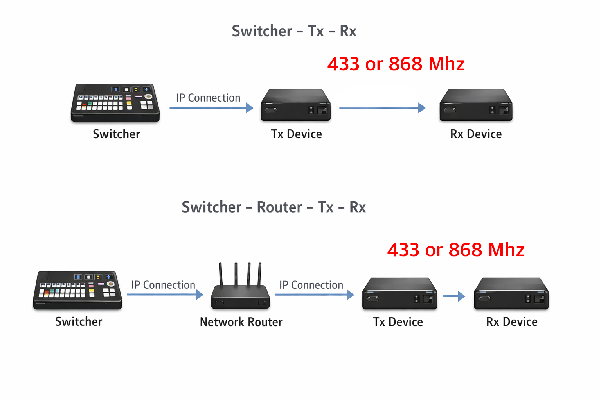

# TALLY-NODE

ビデオスイッチャーとのリアルタイム通信を実現するESP32-S3ベースのWi-Fi & Ethernetタリーシステム。

**言語:** [English](README.md) | [한국어](README-ko.md) | 日本語 | [简体中文](README-zh-cn.md) | [Español](README-es.md) | [Français](README-fr.md)

## 概要

TALLY-NODEは、プロフェッショナルグレードの信頼性を維持しながら制作コストを大幅に削減するDIYベースのタリーライトシステムです。ビデオスイッチャーとのリアルタイム通信向けに設計されており、現在はBlackmagic ATEMとvMixをサポートしています。今後、より多くのスイッチャーのサポートを予定しています。

**リンク:**
- ウェブサイト: https://tally-node.com
- 購入: https://tally-node.com/purchase
- TX UI デモ: https://demo.tally-node.com

## 機能

### LoRa無線通信
- **長距離通信**: 都市環境で300mまでテスト済み（環境により異なります）
- **低消費電力**: 標準的なWiFiよりも消費電力が少なく、RXのバッテリー寿命を延長
- **周波数帯域**: 433MHzと868MHzをサポート（各国の規制に基づく）
- **安定した信号**: Chirp Spread Spectrum技術による信頼性の高い通信
- **リアルタイム**: ゼロ遅延の瞬時タリー状態送信

### デュアルモードサポート
- 最大2台のスイッチャーに同時接続可能（ATEM + vMix、vMix + vMixなど）
- WiFiとEthernetを同時に使用して柔軟なネットワーク構成
- 1-20の範囲でチャンネルマッピング

### Webベース制御
- すべてのTX設定のための直感的なWebインターフェース
- ネットワーク設定（WiFi AP、Ethernet DHCP/Static）
- スイッチャー接続設定（IP、ポート、プロトコル）
- RXデバイス管理（明るさ、カラー、カメラ番号）
- Web UI経由のファームウェア更新
- システムログと診断

### RXデバイス管理
- リアルタイムのバッテリーレベルと信号品質モニタリング
- LED明るさ制御（0-100レベル）
- リモート再起動機能
- すべてのRXデバイスの一括設定

## ハードウェア

### TX（送信機）
- IP経由でスイッチャーに接続（WiFi/Ethernet）
- USB-C電源供給および18650バッテリーサポート
- 433MHz / 868MHz LoRaブロードキャスト
- Web UI制御インターフェース
- 最大20台のRXデバイスをサポート

### RX（受信機）
- カメラにマウント可能
- TXから無線タリー信号を受信
- プログラム（赤）、プレビュー（緑）、オフ状態を示すRGB LED
- USB-C充電および18650バッテリー
- 6-8時間のバッテリー寿命（テスト済み）

## 仕様

| 項目 | TX | RX |
|------|----|----|
| 通信方式 | LoRa無線 | LoRa無線 |
| テスト済み通信距離 | 最大300m（都市部） | 最大300m（都市部） |
| 対応スイッチャー | ATEM、vMix | - |
| 対応カメラ数 | 最大20台 | - |
| 電源 | 18650バッテリー、USB-C | 18650バッテリー、USB-C |
| バッテリー寿命 | 最大8時間 | 最大8時間 |
| ネットワーク | Ethernet/WiFi/AP | - |
| 設定方法 | Web UI | ボタン制御 |
| マウント | 1/4インチねじ | 1/4インチねじ |

## 対応スイッチャー

| スイッチャー | ステータス |
|----------|--------|
| Blackmagic ATEM | サポート済み |
| vMix | サポート済み |
| OBS Studio | 予定 |
| OSEE | 予定 |

### テスト済みATEMモデル
- ATEM Television Studioシリーズ
- ATEM Miniシリーズ
- ATEM Constellationシリーズ

## クイックスタート

### TX設定
1. USB-Cで電源を接続するか、18650バッテリーを取り付ける
2. Web UIにアクセス: `192.168.4.1`（APモード）または割り当てられたEthernet IP
3. ネットワーク設定を構成（WiFi/Ethernet）
4. スイッチャー接続を設定（IP、ポート、モード）
5. ブロードキャスト周波数とSYNCWORDを設定
6. ライセンスキーを有効化

### RX設定
1. 18650バッテリーを取り付けるか、USB-Cを接続
2. フロントボタンを長押ししてカメラIDを設定（1-20）
3. 周波数とSYNCWORDがTXと一致していることを確認

## ライセンス

TXデバイスを有効化するにはライセンスコードが必要です。ライセンスは接続可能なRXデバイスの最大数を決定します。ライセンスキーに有効期限はありません。

## デモ

TX Web UIデモを試してください: [https://demo.tally-node.com](https://demo.tally-node.com)

---

ESP32-S3で作られています
