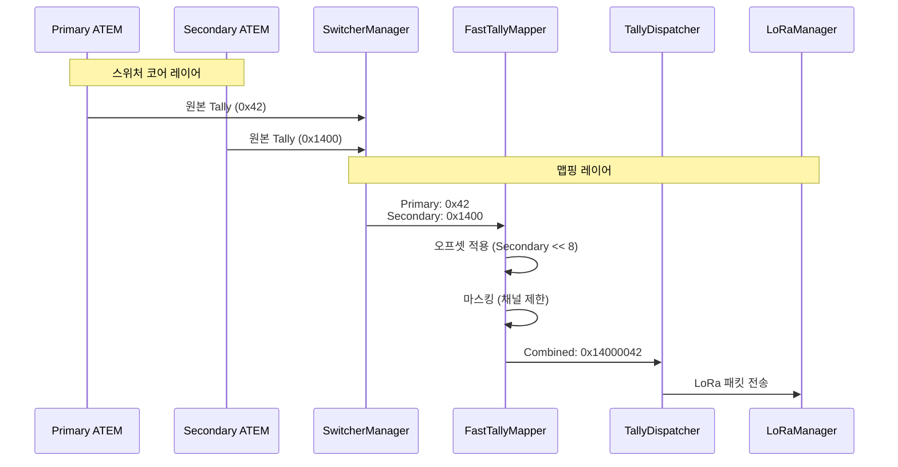
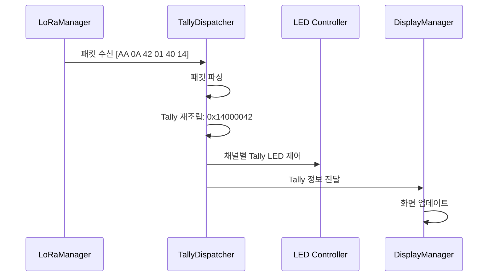
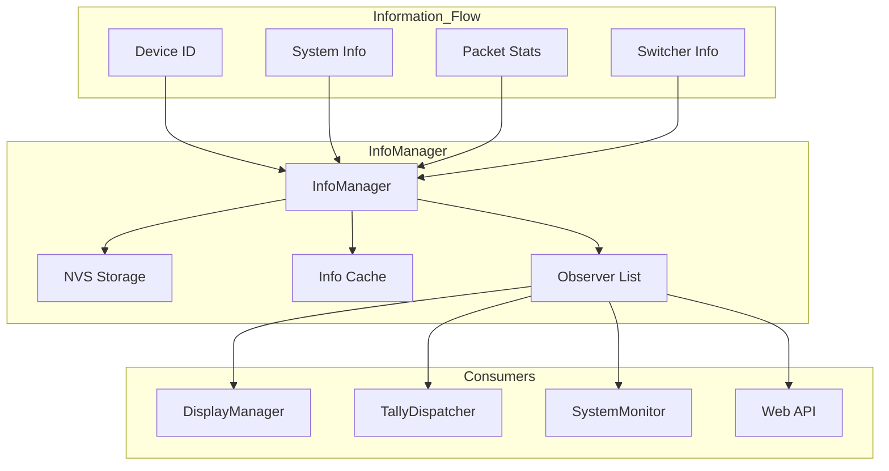

# TALLY-NODE 아키텍처 문서

## 시스템 개요

TALLY-NODE는 ESP32-S3 기반의 무선 Tally 시스템으로, 스위처(ATEM/OBS/vMix)와 통신하여 카메라 Tally 정보를 표시하고 LoRa를 통해 다른 노드와 데이터를 공유합니다.

## 역할 기반 아키텍처

### 4계층 구조

```
┌─────────────────────────────────────────────────────────────┐
│                  Application Layer                           │
│                   (main.cpp)                                │
│              - 시스템 초기화 및 제어                           │
│              - 태스크 스케줄링                               │
└─────────────────────────────────────────────────────────────┘
                              │
┌─────────────────────────────────────────────────────────────┐
│               Domain Manager Layer                          │
│  ┌─────────────┐ ┌─────────────┐ ┌─────────────┐            │
│  │DisplayMgr   │ │CommMgr      │ │NetworkMgr   │            │
│  │- OLED 제어  │ │- LoRa 통신   │ │- WiFi/Eth   │            │
│  │- UI 관리    │ │- 패킷 관리   │ │- IP 설정    │            │
│  └─────────────┘ └─────────────┘ └─────────────┘            │
└─────────────────────────────────────────────────────────────┘
                              │
┌─────────────────────────────────────────────────────────────┐
│                Core Service Layer                           │
│  ┌─────────────┐ ┌─────────────┐ ┌─────────────┐            │
│  │InfoManager   │ │SystemMonitor │ │ConfigCore   │            │
│  │- 정보 중앙관리│ │- 상태 모니터 │ │- 설정 관리   │            │
│  │- Observer    │ │- 하드웨어 정보│ │- NVS 저장    │            │
│  └─────────────┘ └─────────────┘ └─────────────┘            │
└─────────────────────────────────────────────────────────────┘
                              │
┌─────────────────────────────────────────────────────────────┐
│               Infrastructure Layer                          │
│  ┌─────────────┐ ┌─────────────┐ ┌─────────────┐            │
│  │LoRaManager  │ │SwitcherMgr  │ │ButtonPoll   │            │
│  │- SX1262 제어│ │- ATEM/OBS   │ │- 버튼 스캔   │            │
│  │- RF 설정    │ │- vMix 프로토콜│ │- 액션 처리   │            │
│  └─────────────┘ └─────────────┘ └─────────────┘            │
└─────────────────────────────────────────────────────────────┘
```

## 컴포넌트 상세 설계

### 1. 4계층 구조와 스위처 통신

기존 4계층 구조 내에서 스위처 통신은 다음과 같이 위치합니다:

```
┌─────────────────────────────────────────────────────────────┐
│                  Application Layer                           │
│                   (main.cpp)                                │
│              - 시스템 초기화 및 제어                           │
│              - 태스크 스케줄링                               │
└─────────────────────────────────────────────────────────────┘
                              │
┌─────────────────────────────────────────────────────────────┐
│               Domain Manager Layer                          │
│  ┌─────────────┐ ┌─────────────┐ ┌─────────────┐            │
│  │DisplayMgr   │ │CommMgr      │ │NetworkMgr   │            │
│  │- OLED 제어  │ │- LoRa 통신   │ │- WiFi/Eth   │ │
│  │- UI 관리    │ │- 패킷 관리   │ │- IP 설정    │            │
│  │             │ │- TallyDisp. │ │             │            │
│  │             │ │- FastTallyM │ │             │            │
│  └─────────────┘ └─────────────┘ └─────────────┘            │
└─────────────────────────────────────────────────────────────┘
                              │
┌─────────────────────────────────────────────────────────────┐
│                Core Service Layer                           │
│  ┌─────────────┐ ┌─────────────┐ ┌─────────────┐            │
│  │InfoManager   │ │SwitcherMgr  │ │ConfigCore   │            │
│  │- 정보 중앙관리│ │- ATEM/OBS   │ │- 설정 관리   │            │
│  │- Observer    │ │- vMix 프로토콜│ │- NVS 저장    │            │
│  │              │ │- 원본 Tally  │ │             │            │
│  └─────────────┘ └─────────────┘ └─────────────┘            │
└─────────────────────────────────────────────────────────────┘
                              │
┌─────────────────────────────────────────────────────────────┐
│               Infrastructure Layer                          │
│  ┌─────────────┐ ┌─────────────┐ ┌─────────────┐            │
│  │LoRaManager  │ │SystemMonitor │ │ButtonPoll   │            │
│  │- SX1262 제어│ │- 하드웨어 감시│ │- 버튼 스캔   │            │
│  │- RF 설정    │ │- 상태 모니터 │ │- 액션 처리   │            │
│  └─────────────┘ └─────────────┘ └─────────────┘            │
└─────────────────────────────────────────────────────────────┘
```

### 2. 듀얼 모드 Tally 데이터 흐름

#### TX 모드 (송신기)



#### RX 모드 (수신기)



### 3. Tally 데이터 패킹 및 맵핑

#### 원본 Tally 데이터
```
Primary (채널 1-8):   0x0000000000000042
비트 0-1: 01 (채널 1: PGM)
비트 6-7: 10 (채널 4: PVW)

Secondary (채널 1-6): 0x0000000000001400
비트 8-9: 01 (채널 5: PGM)
비트 10-11: 10 (채널 6: PVW)
```

#### FastTallyMapper 처리 과정
```cpp
// 1. 설정 정보
Primary:   offset=0,   limit=8
Secondary: offset=4,   limit=6

// 2. 오프셋 적용
secondary_shifted = 0x1400 << (4 * 2) = 0x14000000

// 3. 마스킹
primary_masked = 0x42 & 0xFFFF = 0x42
secondary_masked = 0x14000000 & 0xFFF0000 = 0x14000000

// 4. 결합
combined = 0x42 | 0x14000000 = 0x14000042
```

### 4. LoRa 패킷 구조

```
+--------+--------+--------+--------+--------+--------+
| Header | Count | Tally Data (N bytes)              |
| (1B)   | (1B)   |                                   |
+--------+--------+--------+--------+--------+--------+
```

- **Header**: 0xAA (Tally 패킷 식별자)
- **Count**: 유효 채널 수 (1-20)
- **Tally Data**: 채널당 2비트, 바이트 단위 패킹 (LSB first)

#### 패킷 생성 예시
```
Combined Tally: 0x14000042
채널 1-8:   42 01 00 00
채널 9-16:  40 14 00 00
송신 데이터: [AA 0A 42 01 40 14]
```

### 5. InfoManager (핵심 서비스)

InfoManager는 시스템의 모든 정보를 중앙에서 관리합니다.



**주요 기능:**
- 장치 ID 관리 (WiFi MAC 기반 자동 생성)
- 시스템 정보 캐싱 (배터리, 온도, 업타임 등)
- 패킷 통계 관리 (송수신 카운트)
- 스위처 연결 상태 관리
- Observer 패턴으로 실시간 알림
- NVS 영속화

### 6. 컴포넌트 의존성

```
components/
├── info/                    # Core Service
│   ├── InfoManager.hpp      # C++ 핵심 클래스
│   ├── info_manager.h       # C 인터페이스
│   ├── DeviceIdManager.cpp  # 장치 ID 생성
│   └── info_manager_c.cpp   # C/C++ 브릿지
│
├── switcher/                # 스위처 코어 레이어
│   ├── manager/            # SwitcherManager
│   │   └── SwitcherManager.cpp
│   ├── handler/            # 스위처 핸들러
│   │   └── switcher.c
│   └── protocol/           # 각 스위처 프로토콜
│       ├── atem/
│       ├── vmix/
│       └── obs/
│
├── lora/                    # 맵핑 레이어 + Infrastructure
│   ├── service/            # TallyDispatcher
│   │   └── TallyDispatcher.cpp
│   ├── protocol/           # LoRa 프로토콜
│   │   └── LoRaPacket.cpp
│   ├── manager/            # LoRa 관리
│   │   └── LoRaManager.cpp
│   └── core/               # 하드웨어 추상
│       └── LoRaCore.cpp
│
├── display/                 # Domain Manager
│   ├── DisplayManager.cpp   # 디스플레이 관리
│   ├── RxPage.cpp          # RX 모드 페이지
│   └── TxPage.cpp          # TX 모드 페이지
│
├── system/                  # Core Service
│   ├── monitor/            # 시스템 모니터
│   │   └── SystemMonitor.cpp
│   └── config/             # 설정 관리
│       └── ConfigCore.cpp
│
└── interface_web/           # Domain Manager
    ├── WebServerCore.cpp    # HTTP 서버
    ├── ApiHandler.cpp       # REST API
    └── MonitorApi.cpp       # 모니터링 API
```

## 메모리 레이아웃

### TX 모드
```
메모리 사용량 (327KB RAM)
├── FreeRTOS 태스크 스택: ~60KB
├── LoRa 패킷 버퍼: ~4KB
├── 웹 서버: ~20KB
├── InfoManager 캐시: ~1KB
├── FastTallyMapper: ~0.5KB (맵핑 테이블)
├── 스위처 연결 버퍼: ~2KB (ATEM × 2)
├── 디스플레이 버퍼: ~2KB
└── 기타: ~15KB
총 사용: ~104.5KB (32%)
```

### RX 모드
```
메모리 사용량 (327KB RAM)
├── FreeRTOS 태스크 스택: ~40KB
├── LoRa 패킷 버퍼: ~4KB
├── InfoManager 캐시: ~1KB
├── FastTallyMapper: ~0.5KB
├── 디스플레이 버퍼: ~2KB
└── 기타: ~10KB
총 사용: ~57.5KB (18%)
```

## 스레딩 모델

### 태스크 목록

| 태스크 이름 | 우선순위 | 스택 크기 | 역할 |
|-------------|----------|-----------|------|
| main | 1 | 8KB | 시스템 초기화 |
| display | 3 | 8KB | OLED 제어 |
| lora_tx | 4 | 4KB | LoRa 송신 |
| lora_rx | 4 | 4KB | LoRa 수신 |
| button_poll | 5 | 2KB | 버튼 스캔 |
| tally_dispatcher | 4 | 4KB | Tally 맵핑 및 전송 (TX 전용) |
| web_server | 2 | 16KB | HTTP 서버 (TX 전용) |
| switcher_connect | 2 | 4KB | 스위처 연결 (TX 전용) |

### 동기화

- **InfoManager**: std::mutex로 모든 API 보호
- **DisplayManager**: 세마포어로 I2C 접근 동기화
- **LoRaManager**: 큐로 송수신 동기화
- **Observer**: 복사-콜백 패턴으로 데드락 방지

## 설정 관리

### NVS 네임스페이스

```
NVS Storage
├── info_mgr          # InfoManager
│   ├── device_id     # 장치 ID
│   └── id_gen_type   # ID 생성 타입
├── config            # ConfigCore
│   ├── camera_id     # 카메라 ID
│   ├── lora_freq     # LoRa 주파수
│   └── display Brightness # 밝기
└── wifi_config       # NetworkManager
    ├── ssid          # WiFi SSID
    └── password      # WiFi 비밀번호
```

## 에러 처리

### 에러 전파

```
Component A
    ↓ Result<T>/ESP_ERR
Component B
    ↓ Result<T>/ESP_ERR
Component C
    ↓ Result<T>/ESP_ERR
Application (main.cpp)
    ↓ 로그/복구
```

### 복구 전략

1. **LoRa 통신 오류**: Watchdog 타이머로 감지, 자동 재시작
2. **스위처 연결 실패**: 5초 간격으로 재시도
3. **디스플레이 오류**: I2C 리셋, 재초기화
4. **메모리 부족**: 태스크 스택 정리, 캐시 초기화

## 성능 최적화

### 1. 메모리 최적화
- **정적 할당**: 동적 할당 최소화
- **버퍼 재사용**: LoRa 패킷 버퍼 공유
- **메모리 풀**: 작은 객체들을 위한 풀 사용

### 2. CPU 최적화
- **이벤트 기반**: 폴링 대신 인터럽트/큐 사용
- **캐싱**: InfoManager 정보 캐싱으로 중복 계산 방지
- **배치 처리**: 여러 작업을 한 번에 처리

### 3. 네트워크 최적화
- **압축**: Tally 데이터 비트맵으로 압축
- **주기적 전송**: 변경이 있을 때만 전송
- **에러 제어**: CRC 체크, 재전송

## 확장성 고려

### 1. 프로토콜 확장
- **패킷 타입**: 예약된 타입으로 향후 확장
- **버전 관리**: 패킷에 버전 필드 추가
- **필드 확장**: 예약된 바이트로 추가 정보

### 2. 기능 모듈
- **플러그인**: 새로운 스위처 프로토콜 추가 용이
- **설정**: 런타임 설정 변경 지원
- **로깅**: 선택적 디버그 로그

## 보안 고려사항

### 1. LoRa 보안
- **암호화**: 선택적 AES-128 암호화
- **인증**: 패킷 인증 코드
- **주파수 홉핑**: 간섭 방지

### 2. 웹 보안
- **인증**: 기본 인증 지원
- **HTTPS**: mTLS 지원 (향후)
- **CORS**: 도메인 제한

## 테스트 전략

### 1. 단위 테스트
- **InfoManager**: 스레드 안전성 테스트
- **LoRaManager**: 패킷 유효성 테스트
- **Observer**: 콜백 동작 테스트

### 2. 통합 테스트
- **E2E**: 스위처 → LoRa → 디스플레이
- **부하 테스트**: 다중 패킷 처리
- **안정성**: 장시간 운영 테스트

### 3. 하드웨어 테스트
- **RF 전력**: 출력 측정
- **전류**: 소비 전류 측정
- **온도**: 고온 동작 테스트